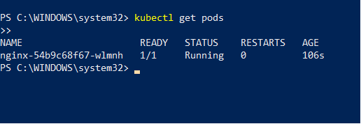
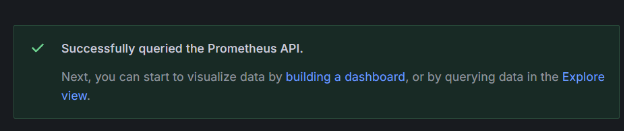
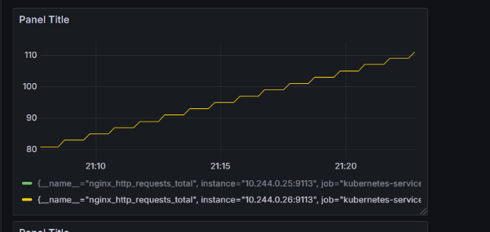
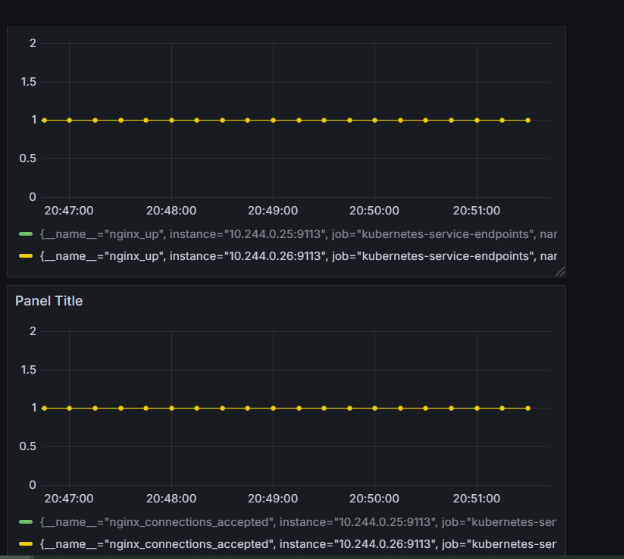

Честно, для человека, который видит это всё впервые, это была смерть, работал я на Windows

Для начала я запустил hyperv

Далее я установил minikube с сайта и файла установщика, kubectl тоже, затем запустил minikube, а также файл nginx-deployment для развёртывания. Мониторить буду сервер nginx

Вроде запустился:

Далее был запущен и установлен прометеус в созданный вместе с ним namespace hello

Графана туда же в hello, далее получен пароль для входа, в декодированном виде команда не работала (тут этого не видно, но это далеко не первая попытка, поэтому правда не работала), пароль был декодирован на первом попавшемся сайте

Далее графана запущена на порте 3000

Теперь я попал в приятный интерфейс (когда я попал в него впервые, я думал, что дело за малым, я никогда так не ошибался…..)

Вошёл сразу, расшифрованный пароль с первого же сайта - подошёл

Далее нужно было подвязать прометеус, для чего был выведен список сервисов

Прописана ссылка, подключение прошло успешно (хотя бы тут всегда срабатывало с первого раза, только svs один раз написал вместо svc, ёкнуло на мгновение не слабо)

Как data source выбран прометеус, а далее показано несколько графиков мониторинга

Наконец появились метрики nginx, боже мой, сначала я вообще не создавал namespace, зашёл в графану, всё было отлично, НО, не было этих метрик, потом всё заново, через namespace, потом пробовал ещё что-то добавить, что-то убрать, все говорили, что не работало из-за разного, честно, так и не понял, что именно помогло, но они появились, поэтому в принципе всё безумно перепуталось в голове в ходе выполнения лабы, когда-нибудь я подружусь с командной стокой…

Если я правильно понял, то здесь общее количество запросов:

А ниже, что он активен, и что есть одно подключение

