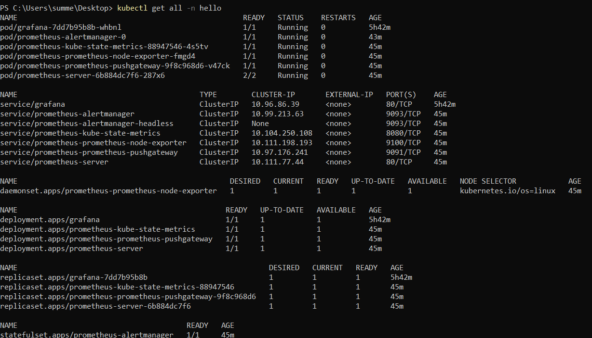
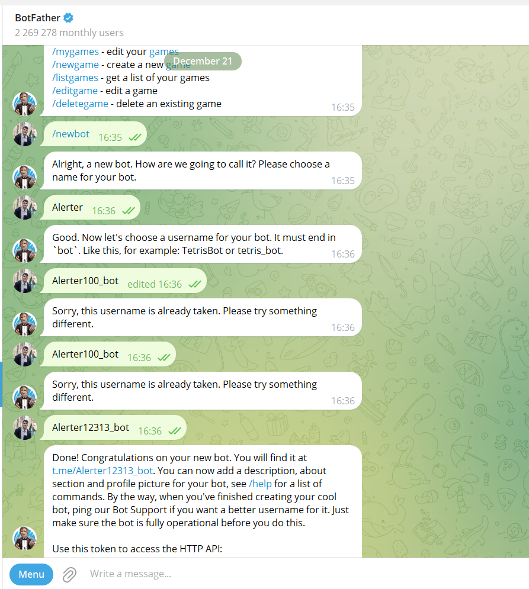
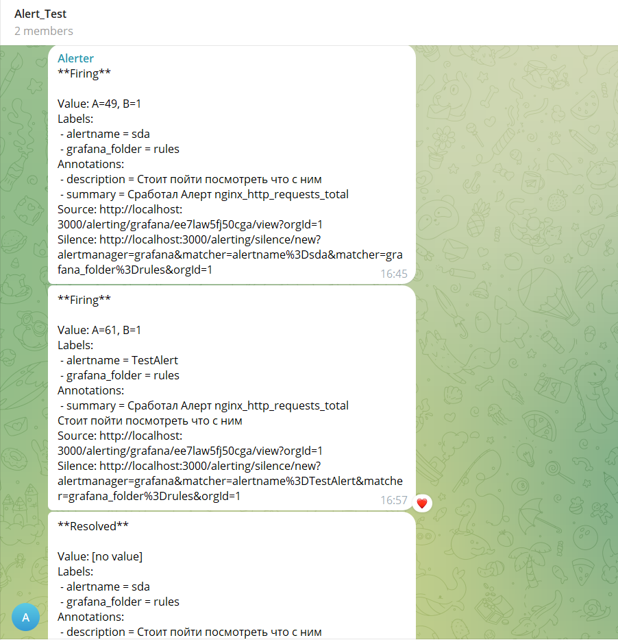
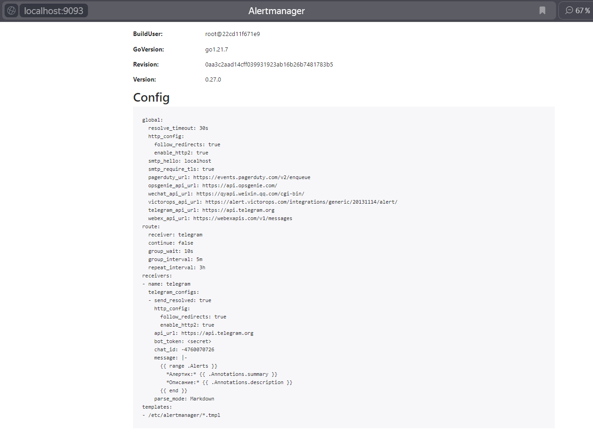
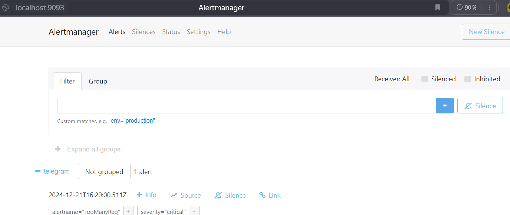
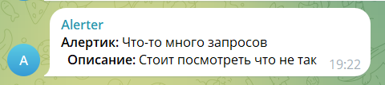

## Лабораторная работа 5 *

## Введение

В основной части лабы уже были подняты grafana и prometheus (через ```helm install```), поэтому здесь остается описать конфиг для арлерт-менеджера.

Вот результат ```kuberctl get all```:



Изначально я решил попробовать накликать алерт в UI самой графаны. Это в итоге тоже получилось, скрины будут ниже. 
 
Но потом я понял, почему в лабе сказано не использовать UI графаны :) - нужно чтобы за алерты отвечал сам Prometheus. 

Поэтому я пошел писать конфиг алертов для него.

## Создание алерта

Так как с в основной части лабы метрики снимались с Nginx, я решил что навесить алерт стоит на какую-нибудь из его метрик. 

Для примера я решил взять метрику http запросов в nginx, и сделать дле нее порог в 50.
```
sum(nginx_http_requests_total{instance="10.244.0.19:9113"})
``` 

Далее нужно было  определиться куда будем отправлять алерт - сначала я хотел писать на почту, но столкнувшись с тем, что необходимо конфигурировать SMTP-сервер (это я увидел ещё при настройке алерта в UI графаны, возможно в Prometheus бы не пришлось этого делать, но от от идеи с почтой я уже отказался), я решил пойти более простым путем и выбрал Telegram, где быстро накликал своего бота с помощью BotFather.



Затем я создал чат, в который и добавил этого бота.

В итоге накликанные в графане алерты начали успешно прилетать в чатик (у них там задан какой-то дефолтный темплейт для них). 



После этого я уже начал настраивать алертинг с помощью конфигов Prometheus, и в итоге накликал примерно такой yml файл:

```yml
alertmanager:
  config:
    global:
      resolve_timeout: 30s
      telegram_api_url: "https://api.telegram.org"

    route:
      receiver: telegram

    receivers:
      - name: telegram
        telegram_configs:
          - chat_id: <id чата>
            bot_token: "<токен бота>"
            api_url: "https://api.telegram.org"
            send_resolved: true
            parse_mode: Markdown
            message: |-
              {{ range .Alerts }}
                *Алертик:* {{ .Annotations.summary }}
                *Описание:* {{ .Annotations.description }}
              {{ end }}

serverFiles:
  alerting_rules.yml:
    groups:
      - name: nginx-alerts
        rules:
          - alert: TooManyReq
            expr: sum(nginx_http_requests_total{instance="10.244.0.19:9113"}) > 50
            for: 30s
            labels:
              severity: critical
            annotations:
              summary: "Что-то много запросов"
              description: "Стоит посмотреть что не так"

```

Он не сразу начал работать, с ним пришлось повозиться чуть дольше.

Главные проблемы были с запуском команды, с помощью которой обновляются **values.yaml**:

```bash
helm upgrade -f alertmanager.yml -n monitoring prometheus prometheus-community/prometheus
```

Часто вылетала такая ошибка:

```bash
Error: UPGRADE FAILED: cannot patch "prometheus-neww-alertmanager" with kind StatefulSet: StatefulSet.apps "prometheus-neww-alertmanager" is invalid: spec: Forbidden: updates to statefulset spec for fields other than 'replicas', 'ordinals', 'template', 'updateStrategy', 'persistentVolumeClaimRetentionPolicy' and 'minReadySeconds' are forbidden
```
Но несколько раз откатив Prometheus я все же добился того, чтобы в Prometheus установился валидный конфиг.


Чтобы заходить в Alermanager UI я пробрасывал порты так:
```bash
kubectl port-forward service/prometheus-alertmanager 9093:9093 -n hello
```


Уже после этого  алерт от бота прилетел в чатик телеграмма.



## Заключение

Лаба прикольная и полезная, с конфигами алертов Prometheus пришлось немало повозиться, в UI графаны все было попроще.

Но навреное логичнее, когда за алертинг отвечает Prometheus, а не Grafana :)

И скорее всего в yaml конфигах (и в Prometheus в целом) побольше возможностей конфигурации алертов, чем в UI графаны (хотя возможно в графане тоже можно конфиги использовать, тут уже не погружался)