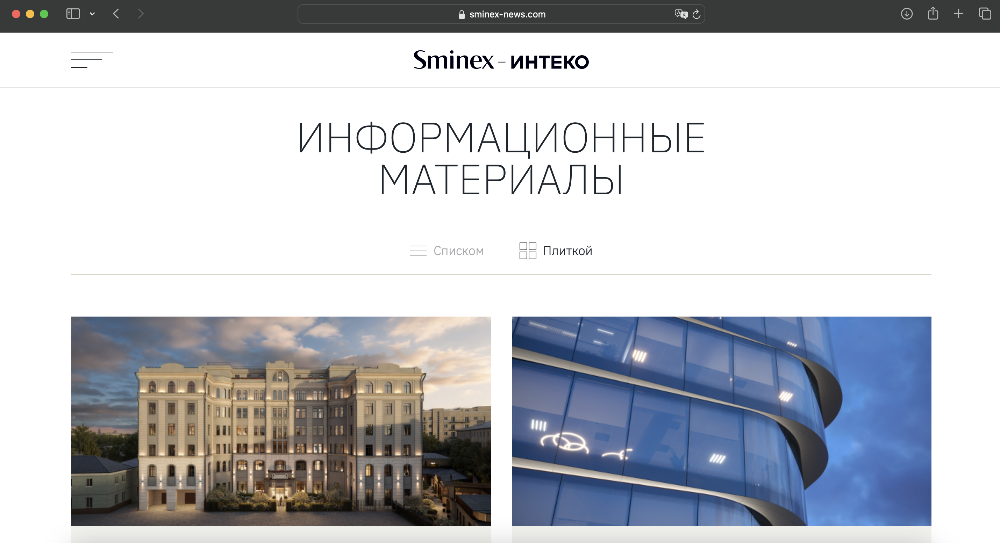
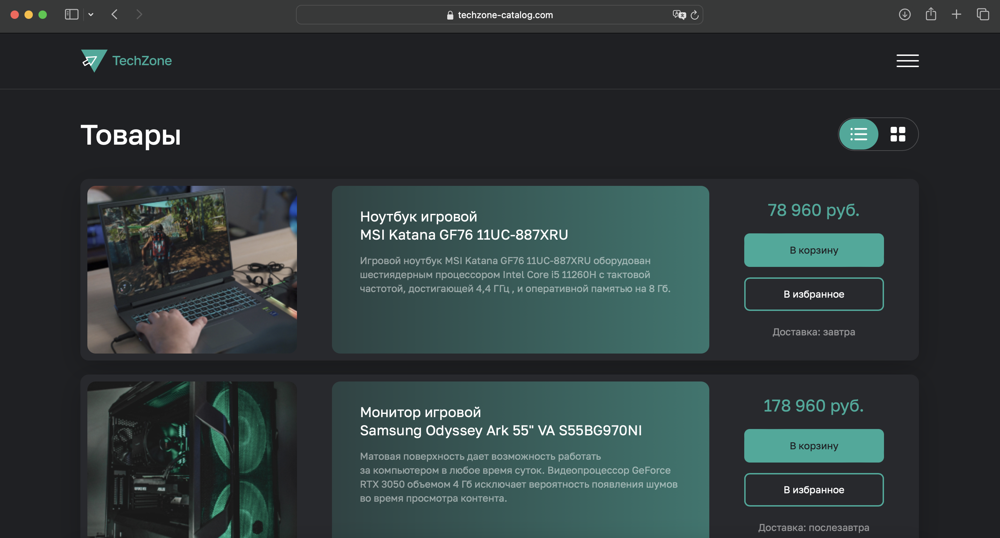
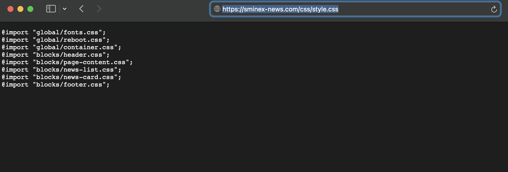
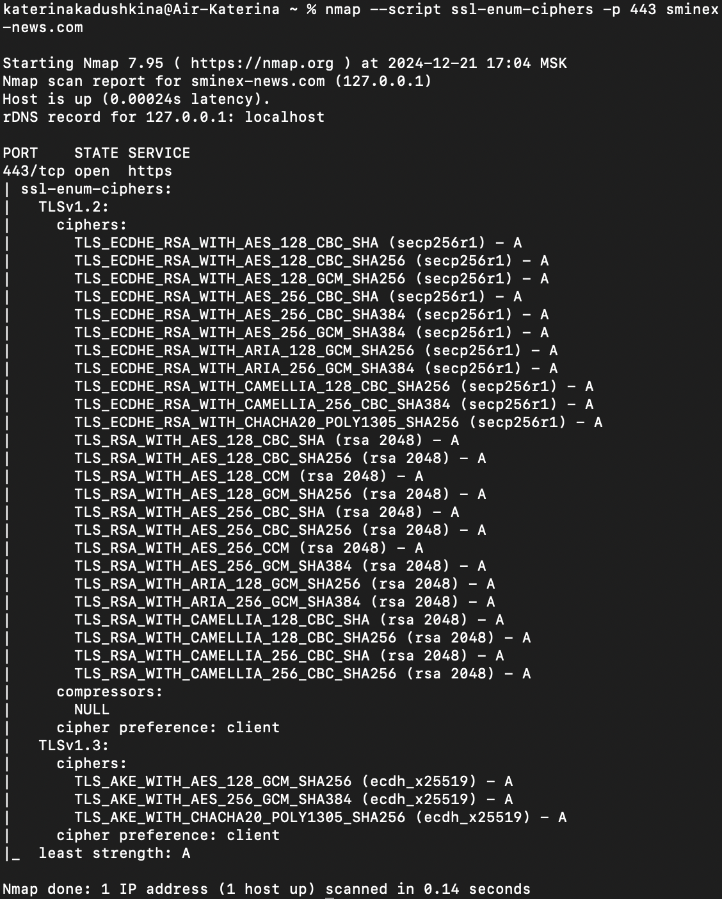
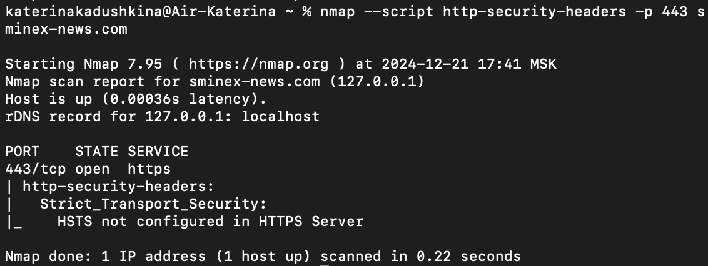

## 1 Лабораторная (со звездочкой)

### Задание

Попробовать взломать nginx другой команды. Проверить минимум три уязвимости - например path traversal, перебор страниц через ffuf и/или любые другие на ваш выбор.
Взлом считается успешным, если вы попали туда, куда не планировалось попадать пользователю, даже если там ничего нет. Успешность взлома не влияет на оценку лаб обеих команд. 
В отчет приложить скрины попыток взлома, описание уязвимостей, на которые проверяли и итог - успешен взлом или нет.


## Выполнение
Был взять nginx команды 10.



### Path Traversal
Был замечен следующий моментик в конфигурации nginx:
```nginx
location /css {
  alias C:/tryn/nginx-1.26.2/html/techzone-catalog.com/css;
}
```

Когда директива ```alias``` используется внутри блока ```location```, она должна оканчиваться символом ```/```. Без завершающего ```/``` запросы могут обрабатываться некорректно, что позволяет злоумышленнику получать доступ к другим файлам.

Правильнее сделать так:
```nginx
location /css/ {
  alias C:/tryn/nginx-1.26.2/html/techzone-catalog.com/css;
}
```

Вообщем из-за этого у нас получилось достать стили, например, по пути ```https://sminex-news.com/css/style.css```.




### SSL/TLS
Здесь нам понадобится nmap — инструмент для сетевого сканирования, который используется для поиска информации о хостах, сервисах и уязвимостях в сети. 

Воспользуемся командой: 
```bash
nmap --script ssl-enum-ciphers -p 443 sminex-news.com
```

Скрипт ssl-enum-ciphers выполняет исследование доступных шифров SSL/TLS на сервере и выводит список поддерживаемых протоколов и шифров.



Мы видим, что поддерживаются последние версии протоколов TLS 1.2 и 1.3. Все шифры имеют высокий уровень безопасности: оценка "A" означает, что они считаются безопасными для использования.

Правда есть одно но: мы сканировали сервер, который работает на локальной машине, данные будут верны только для этой среды. Это полезно для проверки конфигурации тестового сервера перед его развертыванием на продакшене. Однако такие результаты не скажут ничего о публичной конфигурации, если сервер будет перенесен на другую машину.


### HTTP-заголовки
Для сканирования заголовков безопасности нашего сайта с использованием Nmap, можно воспользоваться следующей командой:
```bash
nmap --script http-security-headers -p 443 sminex-news.com
```


Что можно сказать по увиденному: написано, что заголовок Strict-Transport-Security (HSTS) не настроен на сервере. HSTS сообщает браузерам, что сайт всегда должен быть доступен через HTTPS, что помогает защититься от атак "man-in-the-middle" (MITM) и повышения безопасности соединений с сервером. Для nginx можно добить в конфиг следующее:
```nginx
add_header Strict-Transport-Security "max-age=31536000; includeSubDomains; preload";
```
Это настроит HSTS с максимальным сроком действия в 1 год (31536000 секунд) и позволит применять его для всех поддоменов (опция includeSubDomains).

Также можно настроить следующие заголовки:
1. Content-Security-Policy (CSP) - он ограничивает, какие ресурсы (скрипты, стили, изображения и др.) могут быть загружены и выполнены на сайте. Это помогает предотвратить атаки типа XSS (Cross-Site Scripting).
```nginx
add_header Content-Security-Policy "default-src 'self'; script-src 'self' 'https://trusted-scripts.com'; style-src 'self' 'https://trusted-styles.com'; img-src 'self' data: https:;";
```
- default-src 'self': по умолчанию ресурсы загружаются только с текущего домена.
- script-src: скрипты разрешены только с нашего сайта и доверенного источника.
- style-src: аналогично, стили разрешены только из указанных мест.
- img-src: разрешает изображения с HTTPS-источников и inline-данных (data:).

2. X-Content-Type-Options - предотвращает браузер от "угадывания" типа контента. Это снижает риск выполнения вредоносных скриптов, замаскированных под другие файлы.
```nginx
add_header X-Content-Type-Options "nosniff";
```
Если файл, указанный как CSS или JavaScript, не соответствует своему MIME-типу, браузер не попытается выполнить его.

3. X-Frame-Options - запрещает отображение нашего сайта в iframe на других ресурсах, предотвращая кликджекинг (Clickjacking).
```nginx
add_header X-Frame-Options "DENY";
```
- DENY: Полностью запрещает загрузку сайта в iframe.
- SAMEORIGIN: Разрешает загрузку только на этом же домене.

4. Cross-Origin Resource Sharing (CORS) - позволяет настроить доступ для ресурсов, которые загружаются с других доменов.
```nginx
add_header Access-Control-Allow-Origin "https://trusted-domain.com";
```
Разрешает только указанным доменам загружать ресурсы с нашего сайта.
